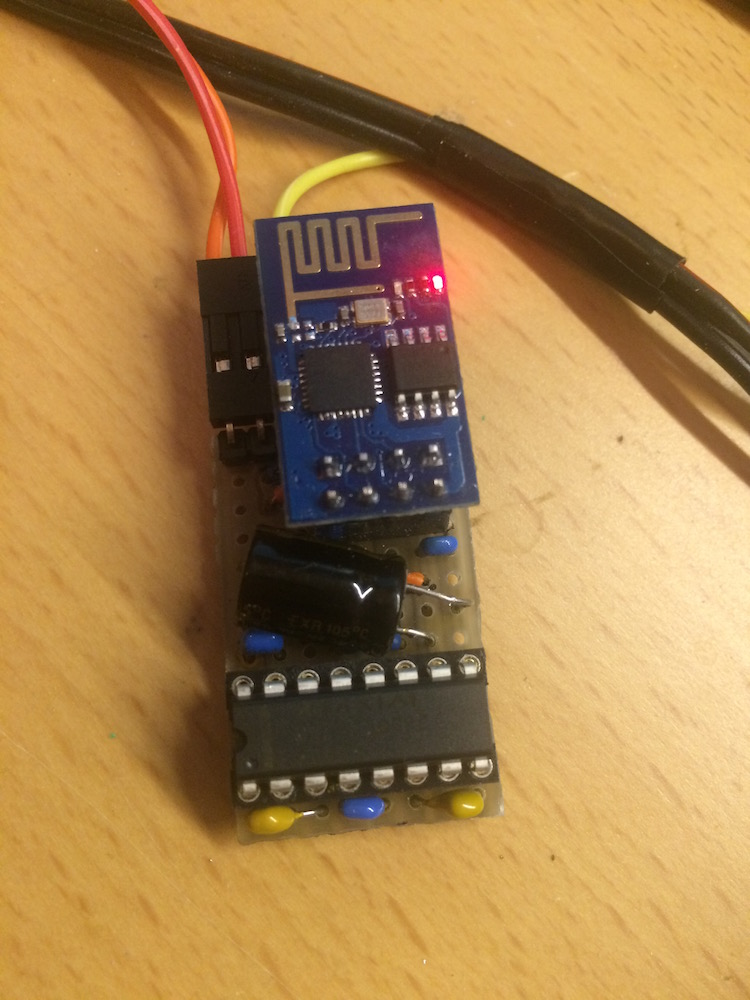
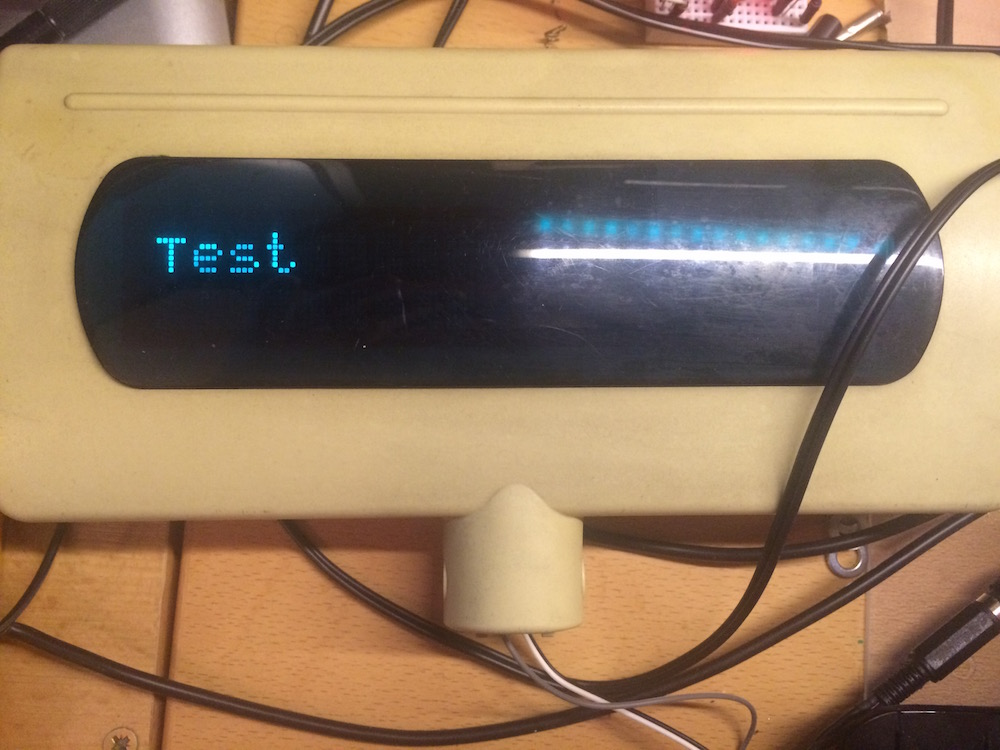

# CoolDisplay
Simple ESP8266 lua script to control old VFD customer display.

Uses simple circuit with MAX3232 (3.3V tolerant) to send data to display via serial.

Works with nodeMcu 0.9.5. Upload files in `dist` directory to your ESP8266 module, compile `web.lua` to `web.lc` and enjoy.

## Preview

